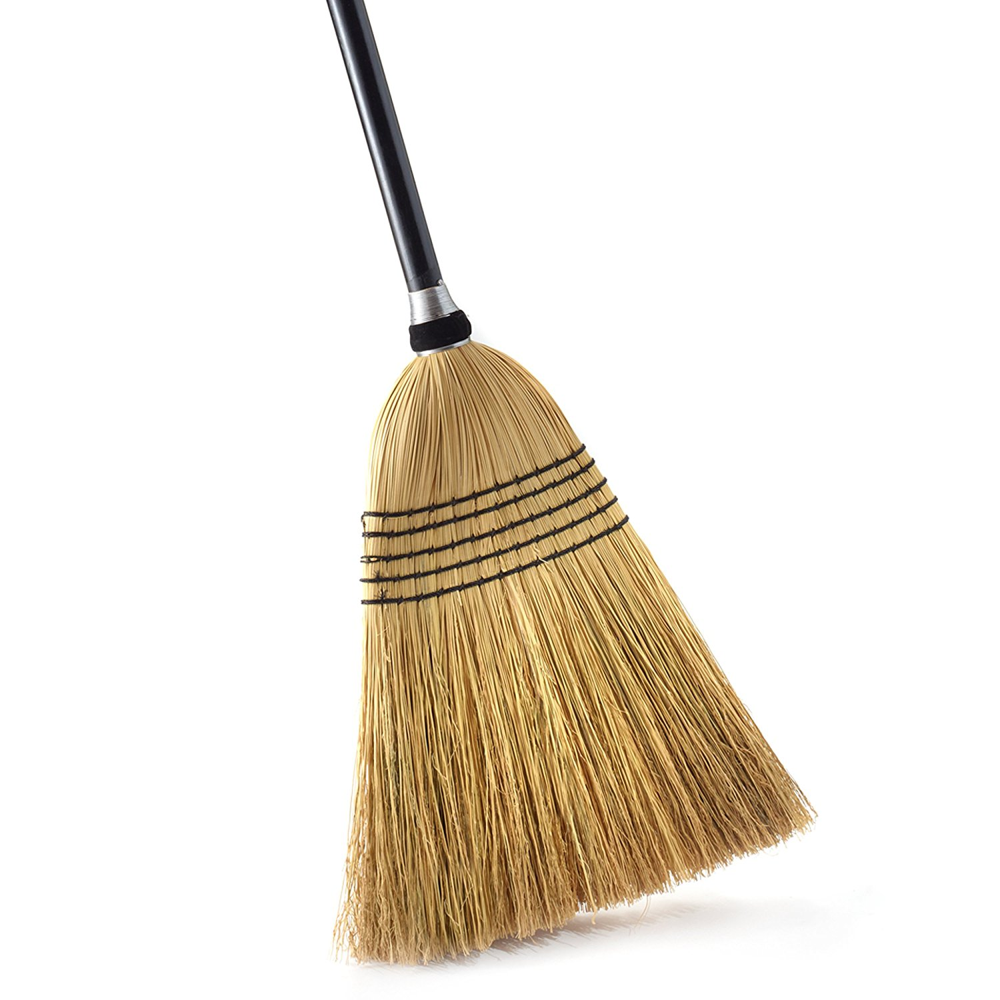

# The Broom

This is a wiki for documenting cool ideas. And stuff.



## The Broomstick
The broom is a weekly meeting of people who like to explore new ideas and work on projects together, with the intention of self improvement and spreading knowledge.

The broom is open ended, but encourages intellectually stimulating conversation. Also the broom hates bureaucracy, so all members have equal say on admins trivia.

## How to Contribute
Clone this repo.
```
git clone https://github.com/the-broom/the-broom.github.io
```
`cd` into the correct folder, and add a file with the `.md` filetype.

Follow standard git procedures to upload to Github.

broom broom!
